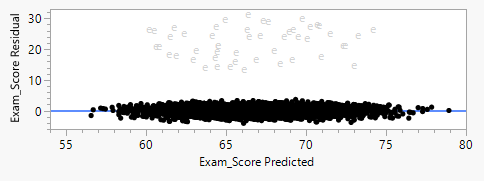
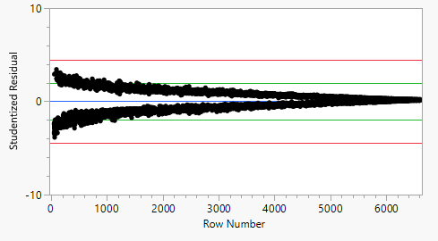
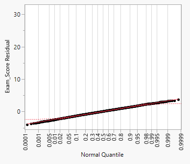

# STAT311
Stat 311 Final Project
# STAT 311 Final Project – Modeling Exam Performance

## Overview

This project models student exam scores using a combination of behavioral, parental, and environmental factors. The goal is to identify which variables best predict exam performance and to build a regression model that both fits the data well and satisfies standard regression assumptions.

We focus on variables that are plausibly actionable for interventions (study habits, attendance, parental involvement, access to resources) while controlling for key background factors such as previous exam scores.

## Data

The dataset contains **6,607** students with the following key variables:

- **Response**
  - `Exam_Score` – exam score (0–100 scale; in this dataset: 55–101)

- **Continuous predictors**
  - `Attendance` – attendance percentage (60–100)
  - `Hours_Studied` – weekly study hours
  - `Sleep_Hours` – hours of sleep per night
  - `Previous_Scores` – prior exam score (50–100)
  - `Tutoring_Sessions` – number of weekly tutoring sessions
  - `Physical_Activity` – hours of physical activity per week

- **Categorical predictors (examples)**
  - `Parental_Involvement` – Low / Medium / High  
  - `Access_to_Resources` – Low / Medium / High  
  - `Parental_Education_Level` – High School / College / Postgraduate  
  - `Family_Income` – Low / Medium / High  
  - `School_Type` – Public / Private  
  - `Learning_Disabilities` – Yes / No  
  - `Internet_Access` – Yes / No  
  - `Peer_Influence` – Negative / Neutral / Positive  
  - `Teacher_Quality` – Low / Medium / High  

Exam scores are centered around **67.2** with a standard deviation of about **3.9**.

## Exploratory Data Analysis

### Univariate patterns

- **Exam_Score** is roughly symmetric, with most scores between 60 and 75 and a thinner right tail of very high scores.
- **Attendance** ranges from 60–100 and is fairly spread out, with a large cluster near ~80%.
- **Previous_Scores** spans 50–100 with a wider spread than the current exam scores.
- **Hours_Studied** is roughly symmetric around ~20 hours per week, with a small number of heavier study loads that look like mild outliers.
- **Sleep_Hours** is approximately normal, centered near 7 hours per night.
- **Tutoring_Sessions** and **Physical_Activity** are right-skewed (most students have few sessions / moderate activity).

### Categorical distributions

Most categorical variables are well-balanced. For example:

- **Parental_Education_Level**: about half High School, ~30% College, ~20% Postgraduate.
- **Peer_Influence**: fairly even split among Negative, Neutral, and Positive.
- **Access_to_Resources**: roughly 20% Low, 50% Medium, 30% High.
- **Learning_Disabilities**: about 10% Yes, 90% No.

### Relationships with Exam Score

A grid of histograms and scatterplots by exam score bands showed that:

- Higher **Attendance**, **Hours_Studied**, and **Previous_Scores** are clearly associated with higher exam scores.
- **Sleep_Hours**, **Tutoring_Sessions**, and **Physical_Activity** show weaker or less systematic patterns across score bands.
- Many categorical variables (e.g., **Parental_Involvement**, **Access_to_Resources**) show shifts in average exam score across levels, suggesting meaningful relationships.

These patterns motivated focusing on a core set of predictors for the main regression models.

## Modeling

### Variable & Baseline Model Selection

We began with all **19** available predictors and ran:

1. **Stepwise regression** (entry/removal α = 0.05)  
   - All variables except **School_Type**, **Gender**, and **Sleep_Hours** entered the model at some point.
2. **All possible models**  
   - We plotted **R²**, **Cp**, and **BIC** against the number of predictors.  
   - There was a clear point of diminishing returns after about **six variables**.

Based on this, we chose a six-predictor main-effects model as our baseline.

### Model 1 – Six-Predictor Main Effects Model

**Predictors in Model 1:**

- `Hours_Studied`  
- `Attendance`  
- `Previous_Scores`  
- `Tutoring_Sessions`  
- `Parental_Involvement` (dummy-coded)  
- `Access_to_Resources` (dummy-coded)

**Fit summary (full data):**

- \( R^2 \approx 0.66 \)  
- Adjusted \( R^2 \approx 0.6596 \)  
- MSE ≈ 5.15  
- Root MSE \( s \approx 2.27 \)  
- Global F-test highly significant (p < .0001)

**Interpretation**

Model 1 explains about **66%** of the variability in exam scores. All included predictors are statistically significant and have meaningful relationships with exam performance:

- Higher **hours studied**, **attendance**, and **previous scores** all correspond to higher predicted exam scores.
- Higher **parental involvement** and **access to resources** levels are associated with higher performance relative to the reference categories.

Because Model 1 provided strong explanatory power with moderate complexity, we used it as our baseline for comparison.

### Model 2 – Two-Way First-Order Interaction Model

Model 2 included:

- All Model 1 main effects  
- **All two-way interactions** between those predictors

**Fit summary (full data):**

- MSE ≈ 5.16  
- \( R^2 \approx 0.66 \) (slightly lower than Model 1)  
- \( s \approx 2.27 \)  
- F-test still highly significant (p < .0001), but many interaction terms not significant.

**Conclusion**

Adding all two-way interactions did **not** improve predictive performance:

- MSE increased slightly and \( R^2 \) decreased slightly.
- Most interactions were not statistically significant.
- The added complexity was not justified.

We therefore did **not** adopt Model 2.

### Model 3 – Quadratic Model

Model 3 tested nonlinear effects by adding quadratic terms for the Model 1 predictors (e.g., `Hours_Studied²`, `Attendance²`, etc.).

**Fit summary (full data):**

- MSE ≈ 5.15 (essentially unchanged)  
- \( R^2 \approx 0.66 \)  
- \( s \approx 2.27 \)

**Conclusion**

The quadratic model also did **not** meaningfully improve performance:

- Slight increase in model complexity, no real decrease in error.
- Most quadratic terms were not significant or only marginally so.
- Adjusted \( R^2 \) decreased slightly.

Because neither interaction nor quadratic terms improved the model, we focused on the **linear six-predictor main-effects model (Model 1)** for diagnostics and refinement.

### Model Comparison Summary

| Model | MSE  | \(R^2\) | \(s\)  | F Ratio  | p-value |
|-------|------|---------|-------|----------|---------|
| 1 – Main effects          | 5.15 | 0.66 | 2.27 | 1600.88 | < .0001 |
| 2 – + all 2-way interactions | 5.16 | 0.66 | 2.27 | 376.72  | < .0001 |
| 3 – + quadratic terms     | 5.15 | 0.66 | 2.27 | 1067.67 | < .0001 |

Model 1 provides the best balance of fit and parsimony.

## Model Diagnostics & Outliers

After settling on Model 1, we conducted a series of diagnostics:

### Residual diagnostics (original fit)

We examined residual plots and the distribution of residuals:

- Residuals vs. Predicted  
- Studentized residuals  
- Normal quantile (Q–Q) plot  
- Distribution of residuals

Overall, the model comes close to satisfying normality and constant variance assumptions, but the plots show a noticeable **cluster of large positive residuals**, suggesting a group of outliers.

```markdown



